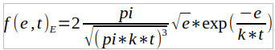

**Приближение функции распыления ьвердого вещества нагретым газом**

**Пример входных данных**

на вход программы принимаются координаты пикселей точек на картинки, размер картинки,
максимальное/минимальное значения по осям, эти параметры нужно редактировать в программе,
также внутри программы можно редактировать шаг интегрирования, шаг ф-ии итд

**Процесс анализа**

Результатом анализа ожидается функция f(e), где e – энергия частицы, а f(e) – коэффициент распыления для данной энергии, основывающийся на исходной функции к-та распыления и распределении максвелла

, где y(e) – исходный график, а fE(e, t) – распределение Максвелла по энергии

, но вместо kt подставляется t, тк она тут в электрон вольтах

**Пример работы**

синий график - входные данные
оранжевый - приближенный коэффициент распыления учитывающий распределение максвелла